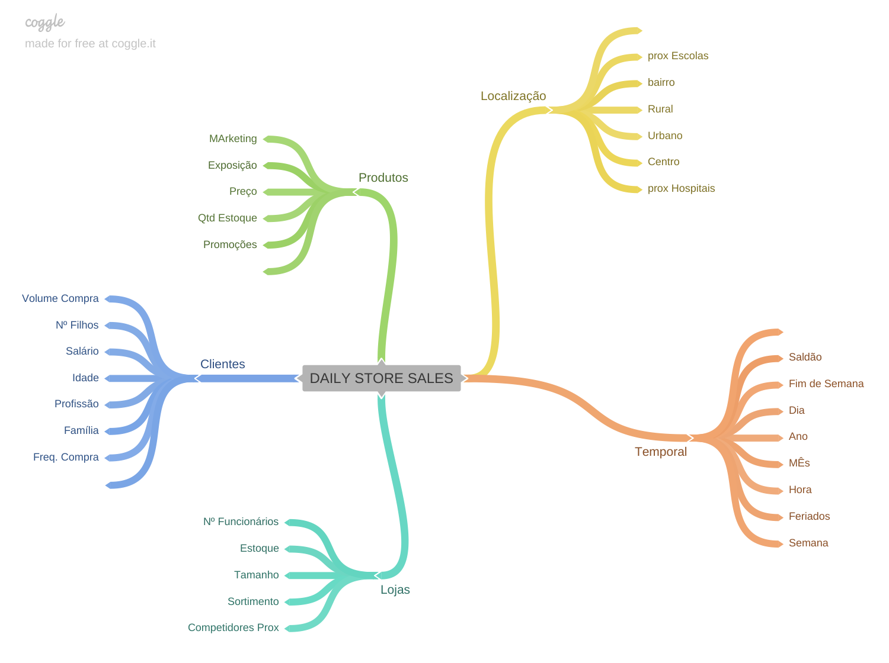
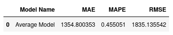
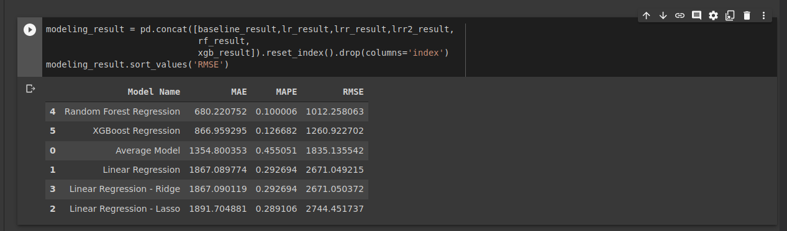
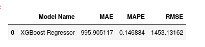
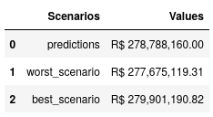
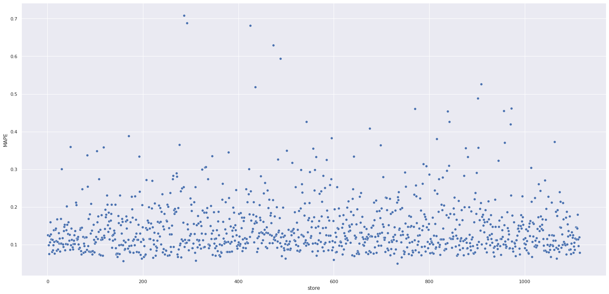
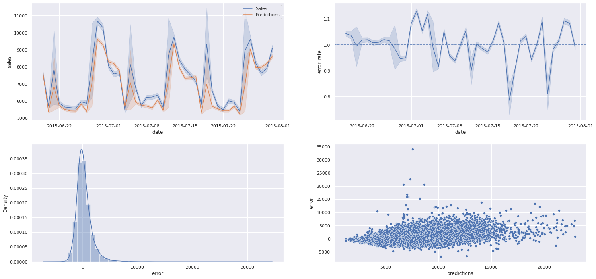
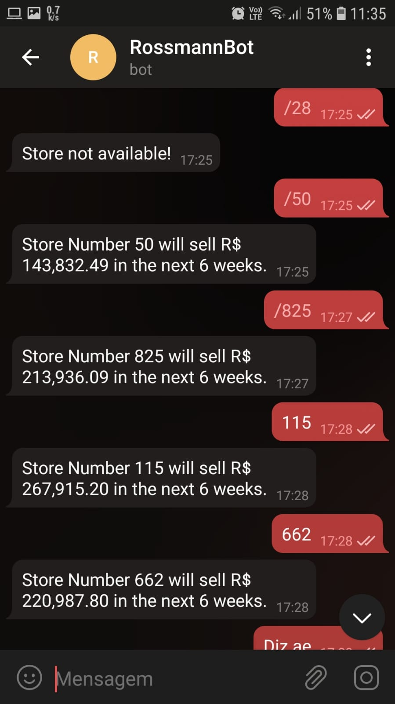

# Rossmann Store Sales

([click here to see this README in :brazil: Brazilian Portuguese :brazil:](README_ptbr.md))

Forecasting the sales revenue from different units of a pharmaceutical company. 

## 1. Business Problem

After a meeting, all the store managers asks for your help with tons of work to do. Talking later with the CFO, you can understand the worries - He plans to conduct an improvement in some units, and needs to know the estimated stores sell revenue for the next 6 weeks to build the more accurate improvement budget as possible. 

When you say that you believe that this task can be made with some prediction models, the CFO and store managers give this task to you. Thus, the work is predicting the stores' revenue, and made the results simple for all managers and the CFO could read and understand without any problem or technical detail

## 2. Business Assumptions

* Filling NA inputs, we are considering the value of 200000 for stores that has not value in `CompetitionDistance` feature (see section 2.1 for more information about the data).
* The model has to be limited to the lowest budget as possible.
* By simplicity, we are considering that the response feature is in Brazilian Reais (R$), not affecting either model or final result.

### 2.1 About the data:

The data are already in tabular form. Accordingly with the data dictionary, the features (columns) are:

* **Store**: store identifier. *(int)*
* **DayOfWeek**: the input day of week. *(int)*
* **Date**: The input date. *(datetime)*
* **Sales**: The response variable, indicating the sell revenue in that day; *(float)*
* **Customers**: the clients quantity in that day; *(int)*
* **Open**: 1 if the store is open, 0 otherwise. *(int)*
* **Promo**: 1 if the store is in type 1 promotion, 0 otherwise. *(int)*
* **Promo2**: 1 if the store is in type 2 promotion, 0 otherwise. *(int)*
* **Promo2SinceWeek**: The month the type 2 promotion took effect.  *(int)*
* **Promo2SinceYear**: The year the type 2 promotion took effect.  *(int)*
* **PromoInterval**: The promotion time interval. *(str)*
* **StateHoliday**: 1 if the date is a state holiday, 0 otherwise. *(int)*
* **SchoolHoliday**: 1 if the date is a scholar holiday, 0 otherwise. *(int)*
* **StoreType**: The store type. *(char)*
* **Assortment**: The store's products assortment. *(char)*
* **CompetitionDistance**: The distance in meters between the store and his closest competitor. (float)
* **CompetitionOpenSinceMonth**: The opening month of closest competitor. *(int)*
* **CompetitionOpenSinceYear**: The opening year of closest competitor. *(int)*

In the absence of test data, the dataset was divided in a way that the six last weeks will correspond to the test dataset.

## 3. Solution Planning

the solution of this problem consists in the use a machine learning model to perform **Learning to Rank** task, i.e., create a sorted list with interested clients on the top from the original data.

Focusing primarily in feedback agility, the solution will follow the **CRISP-DM** methodology applied to data science, with the cycles being repeated as necessary.

Aiming that souloution helps in business decision-making, the solution will follow the steps ahead:

0. **Data Acquisition**: Relevant data acquisition;
1. **Data Description**: In this step we can analyze if there are erroneous/missing data, data types and general information about the data who we will working.
2. **Feature Engineering**: The creation of new features  based in the data to facilitate the most directly analysis as possible. Also, at this point we  formulate some hypothesis searching understand new and until now unseen clients behaviors.
3. **Data Filtering**: In this step, we will filter the data with values different from the feature description and decide how to treat them.
4. **Exploratory Data Analysis**: Data validation focusing in the validation of hypothesis formulated in step 2 and in any other business questions proposed. 
5. **Data Preparation**: Data preparation for machine learning algorithms application.
6. **Feature Selection **: Relevant feature selection,manually (based in EDA step) and using other technical approaches.
7. **Machine Learning Models**: Direct comparison between various machine learning models by using cross validation metrics.
8. **Fine-Tuning Hyperparameters**: The chosen model's parameters otimization.
9. **Final Model**: Chosen final model training.
10. **Business Performance**: Business answer obtained via model use.
11. **Deploy**: Model deploy for easy and intuitive use mainly by non-technical stakeholders.

## 4. Top 5 Data Insights:

Some hypothesis were created and tested based in data, looking for units sell behavior understanding The mind map below helps to group the main circunstances and events that affects the sell.

The top 5 insights were:

1. Stores close to competitors tends to sell more;
2. Stores with more sortment sell less than basic units;
3. Store sales have been declining annually; 
4. The revenue is bigger in the first semester;
5. Stores with more active promotions tend to sell less; 

## 5. Machine Learning Mapa mental de HipótesesModels

The evaluation of the models was based on some of the standard metrics for prediction: 

* MAE - Mean Absolute Error;
* RMSE - Root of Mean Squared Error;
* MAPE - Mean Absolute Percentage Error;

The baseline considered is the sells average for the period. In this case, the results are:

The machine learning models tested for the task and baseline comparison was:

* Linear Regression;
* Regularized Lasso and Ridge (Lasso e Ridge);
* Random Forest;
* XGBoost;

After Cross Validation (K-Fold Cross Validation, 5 Folds), the final results are presented:

We can see straight that the Random Forest Model performs better than the others. However, the model needs to be implemented with fewer costs as possible. Because of this, the chosen model is XGBoost, that demands a storage space approximately 33 times smaller than random forest.

After the parameter fine-tuning (random search for parameters), the final model presented the followed metrics:

## 6. Results

### 6.1 Business Results

Based in model's final metrics, is possible to define 3 possible scenarios: in the best scenario, the revenue is made considering the predictions plus the MAE for each store considered in the problem. In the worst, the revenue is almost the same, but minus the MAE for each store considered. The predictions are expected results for stores in the next six weeks:

The scatterplot below shows the MAPE associated for each store prediction:

### 6.2 Machine Learning Results:

The four plots presented below bring more information about the model performance. In the first figure, the orange line shows the behavior of predicted sells compared with the real sells in the test data, represented by blue line. The upper-right plot shows the the error rate between the predicted sells and the real value for the determined period, presenting variations of approximately 20% for more or less than the real values. The bottom-left plot shows the error distribution, majority around zero, and the last, bottom right plot shows the residuals as a function of the predictions quantity.

## 7.  Deploy

The model, encoders and scalers used in the preparation and transformation steps, once saved in .pkl format, are ready to be used again in the production environment. The main object of class `Rossman` is make all the pipeline with brute data, letting them readable to the model. the small API created runs in a Flask server and do the integration between the model (in Heroku cloud server, as said in section 3) and Telegram API, allowing the operation of a bot that return the sells prediction for the next six weeks based in the store ID. Below, we can see the bot standard operation.

## 8. Conclusions and Lessons Learned

* Machine learning applications are capable to cause impact even in situations where their use is a very counterintuitive option, offering very important and amazing results.
* Different cross validation methods are useful to identify possible learning problems (such overfitting or underfitting). The K-Fold Cross-Validation method is one of most populars, and specially important when we are using temporal data.
* As important as understand the functioning of machine learning models and algorithms is know how to translate the obtained results to business metrics, that speed up the assertive decision making when necessary.

## 9. Next Steps

If there are stakeholders feedbacks, this project come more and more oriented to the company necessities. Additionally, in the next cycle we can add the following tasks:

* Search and eliminate some  possible prediction problem fonts (multicolinearity, data leaking, etc.);
* Elaborate new hypothesis that can bring new insights form the data, and test the hypothesis postponed form this cycle.
* Test new prediction models, aiming to obtain better metrics values.
