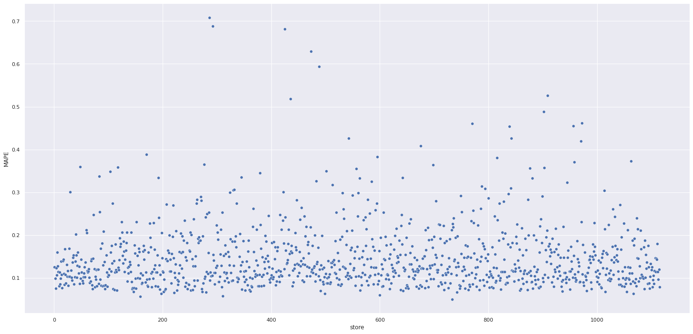
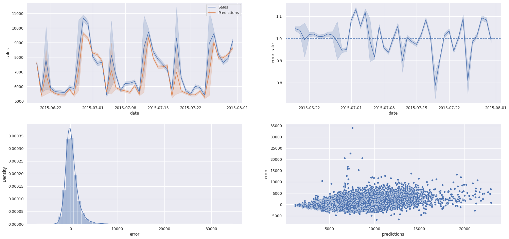
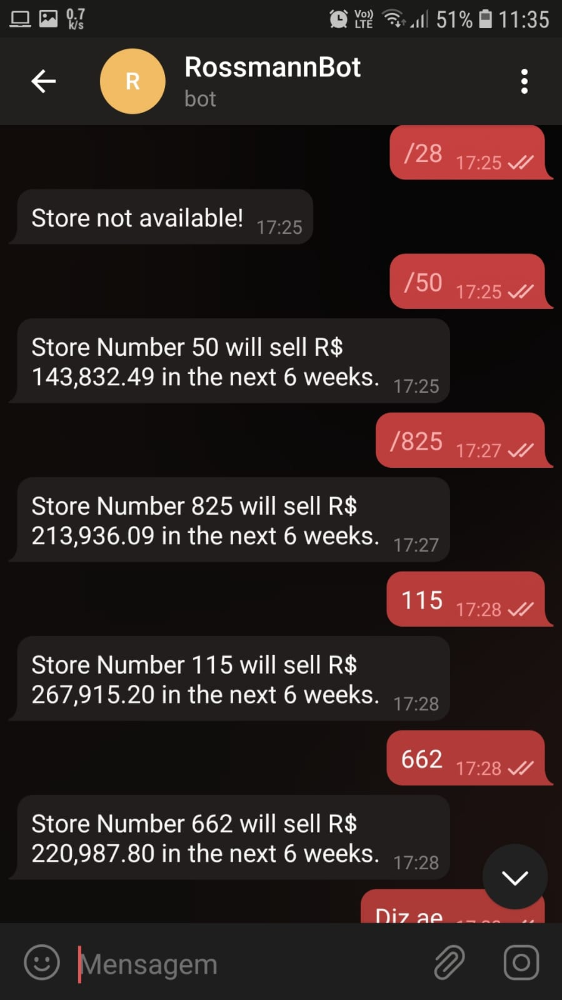

# Rossmann Store Sales

([clique aqui para ler esse README em :us:Inglês:uk:](README.md))

Prevendo o faturamento de vendas de diferentes unidades de uma rede farmacêutica.

## 1. Problema de Negócio

Após uma reunião com toda a direção da empresa, os gerentes de todas as unidades procuraram o time de ciência de dados com o pedido da previsão de vendas de suas respectivas lojas, em caráter de urgência. Em uma reunião posterior com o CFO, o problema se tornou compreendido - a direção planeja escolher algumas lojas para passar por uma reforma, e **a previsão das vendas nas próximas 6 semanas**  é uma variável importante no orçamento das obras. Portanto, com base nos dados de anos anteriores, é função do time de dados fazer as estimativas o mais apurada possível. além de acessível de maneira simples para que os diretores acessem os valores de maneira ágil e fácil para tomar a decisão.

## 2. Assunções de Negócio

* Foi considerado o valor de 200.000 para a variável `competition_distance` de lojas que apresentam o campo em branco (foi admitido que, nestes casos, a loja não tem competidores.)
* Por simplicidade, foi considerado que o valor expresso na variável resposta está em Reais brasileiros (R$), sem o prejuízo de afetar o modelo a ser utilizado.

### 2.1 Sobre os Dados

Os dados encontram-se já em forma tabular. De acordo com o Dicionário de Dados, suas colunas são:

* **Store**: Identificador da loja em questão. *(int)*
* **DayOfWeek**: O dia da semana no qual é feito o registro. *(int)*
* **Date**: A data do registro. *(datetime)*
* **Sales**: A variável resposta do nosso problema; o valor da venda naquele dia;
* **Customers**: A quantidade de clientes que a loja recebe;
* **Open**: 1 se a loja está aberto, 0 caso contrário. *(int)*
* **Promo**: 1 se a loja está fazendo promoção do tipo 1, 0 caso contrário. *(int)*
* **Promo2**: 1 se a loja está fazendo promoção do tipo 2, 0 caso contrário. *(int)*
* **Promo2SinceWeek**:O mês em que a promoção do tipo 2 entrou em vigor *(int)*
* **Promo2SinceYear**:O ano em que a promoção do tipo 2 entrou em vigor *(int)*
* **PromoInterval**: O periodo em meses no qual a promoção esteve em vigor. *(str)*
* **StateHoliday**: 1 se a data refere-se a um feriado estadual, 0 caso contrário. *(int)*
* **SchoolHoliday**: 1 se a data refere-se a um feriado escolar, 0 caso contrário. *(int)*
* **StoreType**: O tipo de loja considerado. *(char)*
* **Assortment**: O tipo de sortimento de produtos. *(char)*
* **CompetitionDistance**: A distância entre a loja eo seu competidor mais próximo.
* **CompetitionOpenSinceMonth**: O mês de abertura da loja concorrente. *(int)*
* **CompetitionOpenSinceYear**: O ano de abertura da loja concorrente. *(int)*

Na ausência de dados que são explicitamente indicados para treino e teste, o dataset foi dividido de maneira que o período correspondente às últimas 6 semanas servissem específicamente para a etapa de testes do modelo a ser aplicado.

## 3. Planejamento da Solução

Com base no pedido feito pelo CFO, o  problema trata de se fazer uma predição dos valores arrecadados de vendas nas próximas 6 semanas. O trabalho será realizado seguindo a metodologia **CRISP-DM** aplicada à ciência de dados, com o objetivo de manter a agilidade na entrega de resultados. O processo consiste nos seguintes passos:

0. **Aquisição de dados**: Aquisição dos dados relevantes para o problema.

1. **Descrição dos dados**: Etapa onde será analisada a existência de dados errôneos/faltantes, tipo de dados e quantidade de informação para ser trabalhada.

2. **Feature Engineering**: Criação de novas features com base nos dados para possibilitar a análise mais direta possível, bem como a criação de hipóteses que podem ajudar a entender mais sobre o problema e como resolvê-lo.
3. **Filtragem de Dados**: Remoção/substituição de valores não condizentes com o atributo selecionado.
4. **Análise Exploratória de Dados**: Análise dos dados, com foco na validação de hipóteses definidas no passo 2.
5. **Preparação de Dados**: Preparação dos dados para aplicação dos modelos de Machine Learning.
6. **Seleção de Features**: Escolha das features que sejam relevantes para a descrição do problema, manualmente e via funções apropriadas.
7. **Modelos de Machine Learning**: Avaliação direta dos modelos de machine learning utilizando métricas com validação cruzada.
8. **Ajuste fino de hiperparâmetros**: Otimização de parâmetros do modelo escolhido para treinamento.
9. **Modelo Final**:  Treinamento final do modelo de machine learning escolhido.
10. **Deploy do modelo final**: Deploy do modelo para utilização de maneira fácil e intuitiva para usuários de áreas não técnicas.

O deploy do modelo final será via api a ser construída, disponível em **https://rossmann-model-test.herokuapp.com/rossmann/predict** e acessível via Telegram por qualquer um dos membros.

## 4. Top 5 Insight de Dados

Várias hipóteses foram formuladas e testadas com base nos dados, com o objetivo de entender a dinâmica do comportamento de venda das unidades.  o mapa mental abaixo auxilia esta etapa, agrupando os principais pontos que afetam vendas de um negócio.

Os 5 maiores insights do negócio foram:

1. Lojas com competidores próximos vendem mais que lojas que não tem competidores;
2. Unidades com o maior sortimento de produto vendem menos em relação as lojas padrão;
3. O faturamento das lojas vem caindo anualmente;
4. O faturamento é maior durante o primeiro semestre do ano;
5. Lojas com mais promoções ativas tendem a vender menos;

## 5. Modelos de Machine Learning

A avaliação dos modelos foi feita com base em algumas das métricas padrão para predição:

* MAE - Mean Absolute Error;
* RMSE - Root of Mean Squared Error;
* MAPE - Mean Absolute Percentage Error;

O baseline considerado desta tarefa foi a Média de vendas no período para as próximas 6 semanas. para ele, temos como resultados:

Os modelos de machine learning testados paraa predição e comparação com o baseline foram:

* Regressão Linear;
* Regressão Linear regularizada (Lasso e Ridge);
* Random Forest;
* XGBoost;

Todos os modelos foram passaram pelo processo de validação cruzada (K-Fold Cross Validation com 5 Folds). Os resultados finais estão representados abaixo:

De imediato, vê-se que o modelo **Random Forest** performa melhor que todos os outros. Entretanto, a decisão de escolha do modelo se baseou não apenas na acurácia do modelo, mas também no seu custo econômico de implementação: O modelo XGBoost, apesar de inicialmente oferecer um RMSE aproximadamente 20% maior que o Random Forest, apresentou uma demanda de armazenamento quase 34 vezes menor, sendo por isso o escolhido para modelar a predição.

Após o ajuste fino dos hiperparâmetros do modelo (feito por Random Search, com parâmetros aleatórios), o modelo final apresentou as seguintes métricas para a predição:

## 6. Resultados

### 6.1 Resultados de negócio

Com base nas métricas finais do modelo escolhido, é possível definir 3 cenários possíveis: o de predição, em que a loja consegue um faturamento aproximadamente igual ao predito; o melhor, em que os valores preditos estão abaixo dos reais pelo valor do MAE; e o pior, nos quais os valores preditos apresentam um resultado maior que o real pelo valor do MAE.  Todos estes se encontram resumidos na imagem abaixo:

O gráfico abaixo mostra, para cada loja, o erro percentual associado à predição. 

### 6.2 Resultados de Machine Learning

Os quatro gráficos representados abaixo trazem mais informações acerca do desempenho do modelo. A primeira delas a linha alaranjada mostra o comportamento das vendas preditas em comparação com a linha azul, que mostra os valores reais do dataset considerado. A figura superior direita mostra o coeficiente entre as predições e e valor predito, com a linha tracejada indicando o valor ótimo da medida. Na figura inferior esquerda, temos um histograma mostrando a distribuição dos erros realizados pelo modelo, e por fim a figura inferior direita mostra os resíduos como função da predição dos modelos.

## 7. Deploy

O modelo, os encoders e os scalers utilizados na etapa de preparação e transformação de dados, uma vez salvos em formato .pkl, estão prontos para serem mais uma vez utilizados no deploy de dados. O objetivo da classe `Rossman` é fazer todo o pipeline dos dados brutos, deixando-os  legíveis para o modelo. A pequena API montada roda em um servidor Flask e faz a integração entre o modelo (hospedado na cloud do Heroku, no link comentado no passo 3) e a API do Telegram, permitindo o funcionamento de um bot que dá a previsão de vendas pelas próximas 6 semanas com base no número identificador da loja. Abaixo, Registra-se o seu uso padrão:

## 8. Conclusões e Lições Aprendidas

* As aplicações de ciências de dados são capazes de causar impactos mesmo em situações que a sua aplicação é originalmente uma opção contraintuitiva, com resultados bastante contundentes e transformadores.
* Métodos de validação cruzada diferentes são úteis para identificar possíveis problemas de apredizado do modelo (overfitting, underfitting). O método conhecido como K-Fold cross-validation, que figura entre os mais populares, é especialmente importante ao lidar com dados que apresentam temporalidade de alguma forma.
* Relações trigonométricas podem ser especialmente úteis para representar dados periódicos também no contexto de ciência de dados;
* Tão ou mais importante que entender sobre o funcionamento dos modelos de machine learning, é necessário também traduzir os resultados obtidos para métricas de negócio, que agilizam a tomada de decisão assertiva acerca do problema.

## 9. Próximos Passos 

Havendo feedbacks dos stakeholders, o projeto pode ser mais direcionado e adequado às necessidades da empresa. Adicionalmente, é definido como passos extras a se tomar no próximo ciclo:

* Procurar e eliminar fontes que atrapalhem o processo de predição (multicolinearidade, Vazamento de dados, etc.);
* Elaborar novas hipóteses que possam trazer novos insights a partir dos dados, além de testar hipóteses inicialmente adiadas neste ciclo;
* Testar mais modelos de predição, visando obter valores mais adequados para as métricas apresentadas.

